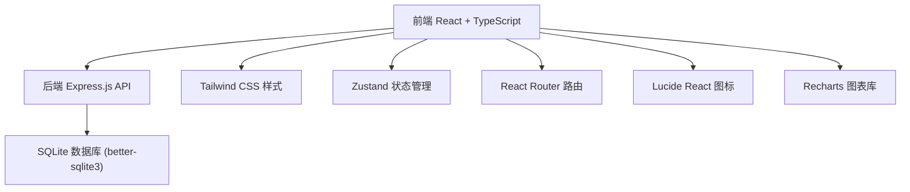
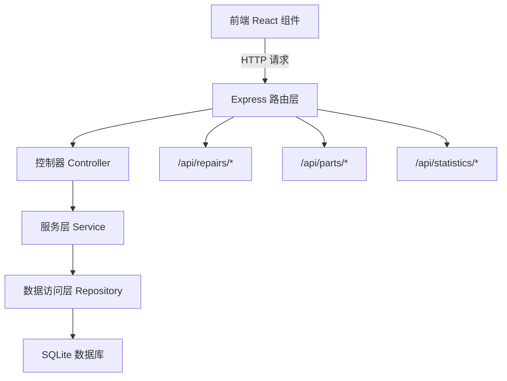
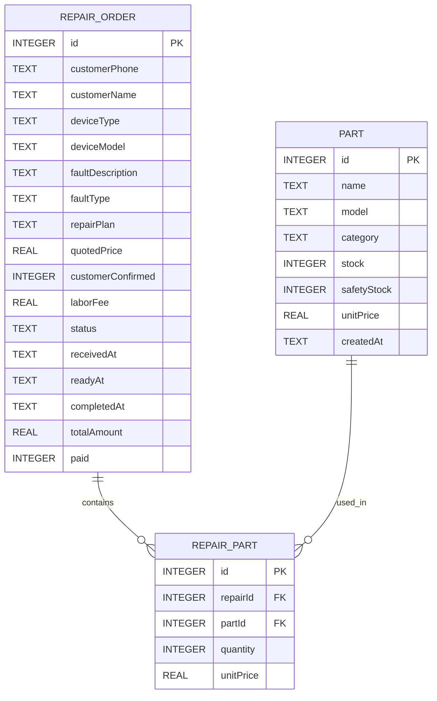

## 1. 架构设计



## 2. 技术描述
- 前端：React@18 + TypeScript + Tailwind CSS@3 + Vite
- 后端：Express@4 + TypeScript
- 数据库：SQLite（通过 better-sqlite3 驱动）
- 状态管理：Zustand
- 路由：React Router DOM
- 图表：Recharts
- 图标：Lucide React
- 初始化工具：vite-init（使用 react-express-ts 模板）

## 3. 路由定义
| 路由 | 用途 |
|------|------|
| / | 仪表盘（超期提醒、今日概览、快速操作） |
| /repairs | 维修单列表 |
| /repairs/new | 新建维修单 |
| /repairs/:id | 维修单详情（含状态流转、零件使用、结算） |
| /inventory | 零件库存列表 |
| /inventory/new | 新增/入库零件 |
| /statistics | 统计报表 |

## 4. API 定义

### 维修单接口
```typescript
// 维修单状态枚举
type RepairStatus = 'pending_check' | 'pending_confirm' | 'repairing' | 'ready' | 'completed' | 'cancelled';

// 维修单类型
interface RepairOrder {
  id: number;
  customerPhone: string;
  customerName?: string;
  deviceType: '电脑' | '笔记本' | '手机' | '其他';
  deviceModel: string;
  faultDescription: string;
  faultType?: string;
  repairPlan?: string;
  quotedPrice?: number;
  customerConfirmed: boolean;
  laborFee: number;
  status: RepairStatus;
  receivedAt: string;
  readyAt?: string;
  completedAt?: string;
  totalAmount?: number;
  paid: boolean;
  partsUsed: RepairPart[];
}

interface RepairPart {
  id: number;
  repairId: number;
  partId: number;
  partName: string;
  quantity: number;
  unitPrice: number;
}

// GET /api/repairs - 获取维修单列表（支持筛选）
// GET /api/repairs/:id - 获取维修单详情
// POST /api/repairs - 创建维修单
// PUT /api/repairs/:id - 更新维修单信息
// PUT /api/repairs/:id/status - 更新维修单状态
// POST /api/repairs/:id/parts - 添加使用零件
// DELETE /api/repairs/:id/parts/:partId - 移除使用零件
// POST /api/repairs/:id/complete - 完成结算
// GET /api/repairs/overdue - 获取超期未取维修单
```

### 零件库存接口
```typescript
interface Part {
  id: number;
  name: string;
  model: string;
  category: string;
  stock: number;
  safetyStock: number;
  unitPrice: number;
  createdAt: string;
}

// GET /api/parts - 获取零件列表
// GET /api/parts/:id - 获取零件详情
// POST /api/parts - 新增零件
// PUT /api/parts/:id - 更新零件信息
// POST /api/parts/:id/stock - 入库操作（增加库存）
// GET /api/parts/low-stock - 获取低库存零件
```

### 统计接口
```typescript
// GET /api/statistics/monthly - 月度维修量统计
// GET /api/statistics/faults - 故障类型统计
// GET /api/statistics/parts - 零件消耗排行
```

## 5. 服务器架构图



## 6. 数据模型

### 6.1 ER 图



### 6.2 DDL 语句

```sql
CREATE TABLE IF NOT EXISTS repair_orders (
  id INTEGER PRIMARY KEY AUTOINCREMENT,
  customerPhone TEXT NOT NULL,
  customerName TEXT,
  deviceType TEXT NOT NULL CHECK(deviceType IN ('电脑', '笔记本', '手机', '其他')),
  deviceModel TEXT NOT NULL,
  faultDescription TEXT NOT NULL,
  faultType TEXT,
  repairPlan TEXT,
  quotedPrice REAL,
  customerConfirmed INTEGER DEFAULT 0,
  laborFee REAL DEFAULT 0,
  status TEXT NOT NULL DEFAULT 'pending_check' CHECK(status IN ('pending_check', 'pending_confirm', 'repairing', 'ready', 'completed', 'cancelled')),
  receivedAt TEXT NOT NULL,
  readyAt TEXT,
  completedAt TEXT,
  totalAmount REAL,
  paid INTEGER DEFAULT 0
);

CREATE TABLE IF NOT EXISTS parts (
  id INTEGER PRIMARY KEY AUTOINCREMENT,
  name TEXT NOT NULL,
  model TEXT NOT NULL,
  category TEXT,
  stock INTEGER NOT NULL DEFAULT 0,
  safetyStock INTEGER NOT NULL DEFAULT 5,
  unitPrice REAL NOT NULL DEFAULT 0,
  createdAt TEXT NOT NULL
);

CREATE TABLE IF NOT EXISTS repair_parts (
  id INTEGER PRIMARY KEY AUTOINCREMENT,
  repairId INTEGER NOT NULL,
  partId INTEGER NOT NULL,
  quantity INTEGER NOT NULL DEFAULT 1,
  unitPrice REAL NOT NULL,
  FOREIGN KEY (repairId) REFERENCES repair_orders(id),
  FOREIGN KEY (partId) REFERENCES parts(id)
);

CREATE INDEX IF NOT EXISTS idx_repair_orders_status ON repair_orders(status);
CREATE INDEX IF NOT EXISTS idx_repair_orders_phone ON repair_orders(customerPhone);
CREATE INDEX IF NOT EXISTS idx_repair_parts_repair ON repair_parts(repairId);
CREATE INDEX IF NOT EXISTS idx_parts_category ON parts(category);
```

### 6.3 初始 Mock 数据

```sql
-- 初始零件
INSERT INTO parts (name, model, category, stock, safetyStock, unitPrice, createdAt) VALUES
('DDR4 内存条', '8GB 3200MHz', '内存', 20, 5, 120, datetime('now')),
('DDR4 内存条', '16GB 3200MHz', '内存', 12, 3, 220, datetime('now')),
('笔记本屏幕', '15.6英寸 FHD IPS', '屏幕', 8, 3, 450, datetime('now')),
('手机屏幕总成', 'iPhone 13 Pro', '屏幕', 3, 2, 850, datetime('now')),
('笔记本电池', '通用型 4400mAh', '电池', 15, 5, 180, datetime('now')),
('手机电池', 'iPhone 13', '电池', 10, 3, 120, datetime('now')),
('固态硬盘', '500GB NVMe', '存储', 18, 5, 280, datetime('now')),
('机械硬盘', '2TB 7200rpm', '存储', 6, 2, 320, datetime('now')),
('电源适配器', '笔记本 19V 4.74A', '电源', 10, 3, 85, datetime('now')),
('主板', 'B550M AM4', '主板', 3, 2, 680, datetime('now'));

-- 初始维修单
INSERT INTO repair_orders (customerPhone, customerName, deviceType, deviceModel, faultDescription, faultType, repairPlan, quotedPrice, customerConfirmed, laborFee, status, receivedAt, totalAmount, paid) VALUES
('13800138001', '张先生', '笔记本', 'ThinkPad T480', '开机无显示，电源指示灯不亮', '开不了机', '检测主板供电，更换电源芯片', 350, 1, 100, 'repairing', datetime('now', '-2 days'), NULL, 0),
('13900139002', '李女士', '手机', 'iPhone 13', '屏幕摔碎，触摸正常', '屏幕碎了', '更换屏幕总成', 980, 1, 80, 'ready', datetime('now', '-4 days'), 1060, 0),
('13700137003', '王经理', '电脑', '组装机 i7-10700', '运行卡顿，经常蓝屏', '系统故障', '重装系统，检测硬盘坏道，更换硬盘', 520, 1, 150, 'pending_confirm', datetime('now', '-1 day'), NULL, 0),
('13600136004', '赵同学', '笔记本', 'MacBook Pro 2019', '电池鼓包，续航不足半小时', '电池问题', '更换电池', 580, 0, 50, 'pending_check', datetime('now', '-5 hours'), NULL, 0),
('13500135005', '孙先生', '手机', '华为 Mate 40 Pro', '充电口松动，无法正常充电', '充电问题', '更换尾插', 180, 1, 50, 'completed', datetime('now', '-8 days'), 230, 1);

-- 维修单使用零件
INSERT INTO repair_parts (repairId, partId, quantity, unitPrice) VALUES
(1, 9, 1, 85),
(2, 4, 1, 850),
(5, 6, 1, 120);
```
